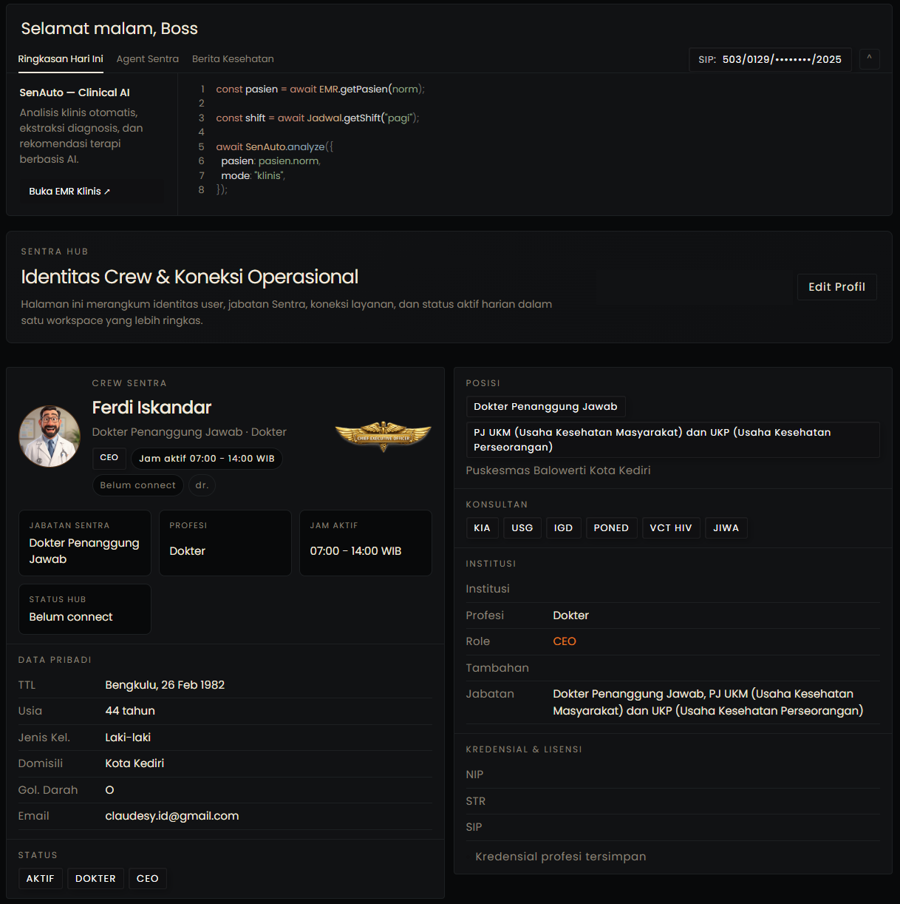

<div align="center">
  
# Healthcare Intelligence Dashboard

**Clinical Information System for Primary Healthcare Facilities**



[](https://nextjs.org/)
[](https://www.typescriptlang.org/)
[](https://react.dev/)
[](https://nodejs.org/)
[](https://railway.app/)
[](./LICENSE)

_Architect & Built by [Claudesy](https://github.com/DocSynapse)_

</div>

---

## Table of Contents

- [Overview](#overview)
- [Key Features](#key-features)
- [Telemedicine Module](#telemedicine-module)
- [Technology Stack](#technology-stack)
- [Architecture](#architecture)
- [Project Structure](#project-structure)
- [Getting Started](#getting-started)
  - [Prerequisites](#prerequisites)
  - [Installation](#installation)
  - [Environment Configuration](#environment-configuration)
  - [Running the Development Server](#running-the-development-server)
  - [Building for Production](#building-for-production)
- [Available Scripts](#available-scripts)
- [API Reference](#api-reference)
- [Deployment](#deployment)
- [Related Documentation](#related-documentation)
- [Security](#security)
- [License](#license)

---

## Overview

**Puskesmas Intelligence Dashboard** is a full-stack internal operations portal purpose-built for **UPTD Puskesmas PONED Balowerti, Kota Kediri**. It consolidates clinical workflows, regulatory reporting, diagnostic intelligence, and real-time team communication into a single unified interface designed for medical staff operating in a primary healthcare (FKTP) environment.

The platform is a product of **Sentra Healthcare Solutions**, founded by **dr. Ferdi Iskandar**, and operates under the guiding principle:

> _"Technology enables, but humans decide."_

The system is designed to reduce administrative overhead on clinicians, improve diagnostic accuracy at the point of care, and ensure compliance with national health reporting standards — all within the resource constraints typical of Indonesian primary healthcare facilities.

---

## Key Features

### User Profile Dashboard

Home view displaying logged-in crew member information, quick-links to government health portals (Satu Sehat, SIPARWA, ePuskesmas, P-Care BPJS), and a clinical patient data overview with vitals, ICD-X coding, and treatment history.

### EMR Auto-Fill Engine

Playwright-driven RPA engine that transfers structured clinical data (anamnesis, diagnosis, prescriptions) into the ePuskesmas electronic medical record system. Communicates transfer progress to the frontend in real-time over Socket.IO, eliminating double-entry burden on clinical staff.

### ICD-X Finder

Multi-version ICD-10 lookup tool supporting the **2010**, **2016**, and **2019** catalogs with dynamic search, fuzzy matching, and legacy code translation. Enables fast and accurate diagnosis coding at the point of care.

### LB1 Report Automation

End-to-end pipeline that ingests exported visit data from ePuskesmas, normalizes and validates records, maps ICD-10 codes to the national LB1 template, and outputs the completed Excel report — along with a QC CSV of rejected records and a JSON summary file for audit trails.

### Audrey — Clinical Consultation AI

Voice-first clinical assistant powered by **Google Gemini Live** (native audio). Operates as a real-time conversational copilot for doctors during patient encounters, providing concise diagnostic insights calibrated for Puskesmas-level resources and constraints.

### ACARS — Internal Chat

Socket.IO-backed team messaging system with room-based conversations, typing indicators, and online presence tracking. Enables seamless communication between clinical and administrative staff within the facility.

### CDSS — Clinical Decision Support

API-driven diagnostic suggestion engine combining a local disease knowledge base (**159 diseases**, **45,030 real encounter records**) with Gemini-powered reasoning to provide ranked differential diagnoses, treatment plans, and referral criteria.

### Crew Access Portal

Authentication gate requiring crew credentials before any dashboard access. Session management uses **HMAC-signed cookies** with a 12-hour TTL. Credentials are sourced from environment variables, a runtime JSON file, or compiled defaults — in that priority order.

### 📹 Telemedicine — Virtual Consultation

Real-time video consultation module enabling remote patient-doctor interactions powered by **WebRTC** peer-to-peer connections, with **Socket.IO** signaling and a STUN/TURN relay fallback for restrictive networks. Supports HD video/audio calls, in-call text chat, file sharing (lab results, prescriptions), and session recording with consent. Each session is linked to the patient's EMR for automatic post-consultation note generation.

---

## Technology Stack

| Layer              | Technology                             |
| ------------------ | -------------------------------------- |
| Framework          | Next.js 16.1 (App Router)              |
| Language           | TypeScript (strict mode)               |
| Runtime            | Node.js >= 20.9.0                      |
| UI Library         | React 19.2                             |
| Font System        | Geist Sans / Geist Mono                |
| Icons              | Lucide React                           |
| Real-time          | Socket.IO (custom HTTP server)         |
| AI / Voice         | Google Gemini 2.5 Flash (native audio) |
| Browser Automation | Playwright                             |
| Spreadsheet I/O    | SheetJS (xlsx)                         |
| Deployment         | Railway (Nixpacks)                     |

---

## Architecture

The application uses a **custom Node.js HTTP server** (`server.ts`) that wraps the Next.js application and integrates Socket.IO for bidirectional real-time communication. This allows long-running background processes (EMR transfer, LB1 automation) to stream live status updates to the frontend without polling.

Key architectural decisions:

- **App Router** (Next.js 16) for file-based routing with server and client component separation
- **Socket.IO rooms** for scoped real-time events per feature (EMR, chat, voice)
- **HMAC cookie sessions** — stateless, tamper-proof, no database dependency for auth
- **RPA via Playwright** — headless browser automation for ePuskesmas integration where no public API exists
- **Tiered credential resolution** — env vars > runtime JSON > compiled defaults, enabling zero-downtime credential rotation

For a full architecture breakdown, see [ARCHITECTURE.md](./ARCHITECTURE.md).

---

## Project Structure

```
healthcare-dashboard/
├── server.ts                  # Custom HTTP + Socket.IO server entry point
├── next.config.ts             # Next.js configuration
├── tsconfig.json              # TypeScript configuration (strict)
├── railway.toml               # Railway deployment configuration
├── package.json               # Dependencies and npm scripts
│
├── src/
│   ├── app/
│   │   ├── layout.tsx         # Root layout (ThemeProvider + CrewAccessGate + AppNav)
│   │   ├── page.tsx           # Home / User Profile dashboard
│   │   ├── globals.css        # Global CSS with dark/light theme tokens
│   │   ├── emr/               # EMR Auto-Fill interface
│   │   ├── icdx/              # ICD-X lookup page
│   │   ├── report/            # LB1 report generation page
│   │   ├── voice/             # Audrey voice consultation page
│   │   ├── acars/             # Internal chat page
│   │   ├── chat/              # Chat contacts prototype
│   │   ├── pasien/            # Patient records page
│   │   └── api/
│   │       ├── auth/          # Login, logout, session endpoints
│   │       ├── cdss/          # Clinical decision support API
│   │       ├── emr/           # EMR transfer run/status/history
│   │       ├── icdx/          # ICD-10 lookup API
│   │       ├── report/        # LB1 automation API (run, status, history, files)
│   │       ├── voice/         # TTS, chat, token endpoints
│   │       ├── news/          # Health news API
│   │       └── perplexity/    # Perplexity AI integration
│   │
│   ├── components/
│   │   ├── AppNav.tsx         # Sidebar navigation
│   │   ├── CrewAccessGate.tsx # Authentication gate component
│   │   ├── ThemeProvider.tsx  # Dark/light theme context
│   │   └── ui/                # Shared UI components
│   │
│   └── lib/
│       ├── crew-access.ts     # Shared auth types and constants
│       ├── server/            # Server-only auth logic
│       ├── lb1/               # LB1 report engine (config, transform, IO, template writer)
│       ├── emr/               # EMR auto-fill engine (orchestrator, handlers, Playwright)
│       └── icd/               # ICD-10 dynamic database
│
├── docs/
│   └── plans/                 # Design documents and feature specs
│
└── runtime/                   # Runtime configuration files (not committed to VCS)
```

---

## Getting Started

### Prerequisites

Before you begin, ensure you have the following installed:

- **Node.js** `>= 20.9.0` — [Download](https://nodejs.org/)
- **npm** `>= 10.x` (bundled with Node.js)
- **Git** — [Download](https://git-scm.com/)

For the EMR Auto-Fill feature, Playwright requires system-level browser binaries. These are installed automatically as part of the setup steps below.

### Installation

```bash
# 1. Clone the repository
git clone <repository-url>
cd healthcare-dashboard

# 2. Install dependencies
npm install

# 3. Install Playwright browser binaries (required for EMR Auto-Fill)
npx playwright install chromium
```

### Environment Configuration

Create a `.env.local` file in the project root. This file is **never committed to version control**.

```env
# ─── Server ───────────────────────────────────────────────────
PORT=7000

# ─── Authentication ───────────────────────────────────────────
# Use a long, random string in production (e.g., openssl rand -hex 32)
CREW_ACCESS_SECRET=<random-secret-for-production>

# JSON array of crew user objects
CREW_ACCESS_USERS_JSON='[{"username":"...","password":"...","displayName":"..."}]'

# ─── AI Services ──────────────────────────────────────────────
# Google Gemini — used by Audrey (voice) and CDSS
GEMINI_API_KEY=<your-gemini-api-key>

# ─── EMR / ePuskesmas RPA ─────────────────────────────────────
# WARNING: Never commit these values to version control
EMR_BASE_URL=<epuskesmas-instance-url>
EMR_LOGIN_URL=<epuskesmas-login-url>
EMR_USERNAME=<epuskesmas-username>
EMR_PASSWORD=<epuskesmas-password>
EMR_HEADLESS=true
EMR_SESSION_STORAGE_PATH=runtime/emr-session.json

# ─── LB1 Report Engine ────────────────────────────────────────
# LB1 live export memakai kredensial EMR yang sama.
LB1_CONFIG_PATH=runtime/lb1-config.yaml
LB1_DATA_SOURCE_DIR=runtime/lb1-data
LB1_OUTPUT_DIR=runtime/lb1-output
LB1_HISTORY_FILE=runtime/lb1-run-history.jsonl
LB1_TEMPLATE_PATH=runtime/Laporan SP3 LB1.xlsx
LB1_MAPPING_PATH=runtime/diagnosis_mapping.csv
```

> **Configuration Note:** runtime code now reads EMR and LB1 settings from centralized server helpers, so `.env.example`, `README`, and route behavior use the same env contract.

> **Security Note:** `EMR_PASSWORD` and `CREW_ACCESS_SECRET` are sensitive credentials. Rotate them regularly and never expose them in logs or client-side code.

### Running the Development Server

```bash
# Start the custom server with Socket.IO support
npm run dev
```

The application will be available at **[http://localhost:7000](http://localhost:7000)**.

To run Next.js in standard dev mode (without the custom Socket.IO server):

```bash
npm run dev:next
```

### Building for Production

```bash
# Compile the production bundle
npm run build

# Start the production server
npm run start
```

---

## Available Scripts

| Script              | Description                                          |
| ------------------- | ---------------------------------------------------- |
| `npm run dev`       | Start custom server with Socket.IO support via `tsx` |
| `npm run dev:clean` | Clear dev lock file and start the custom server      |
| `npm run dev:next`  | Start Next.js dev server without the custom server   |
| `npm run build`     | Compile the production bundle                        |
| `npm run start`     | Start the production server via the custom server    |

---

## Telemedicine Module

The Telemedicine module provides a complete virtual consultation workflow integrated directly into the clinical dashboard. It enables Puskesmas staff to conduct secure video consultations with patients — reducing the need for in-person visits for follow-ups, medication reviews, and remote triage.

### Key Capabilities

| Capability          | Details                                         |
| ------------------- | ----------------------------------------------- |
| Video Engine        | WebRTC (peer-to-peer, browser-native)           |
| Signaling           | Socket.IO rooms per consultation session        |
| Network Fallback    | STUN/TURN relay for restricted NAT environments |
| Audio/Video Quality | Adaptive bitrate, HD (720p default)             |
| In-call Chat        | Real-time text with file attachment support     |
| Session Recording   | Opt-in, consent-gated, stored server-side       |
| EMR Integration     | Auto-generates SOAP note draft post-session     |
| Scheduling          | Built-in appointment slot management            |
| Queue Management    | Virtual waiting room with estimated wait time   |
| Patient Link        | One-time URL sent via SMS/WhatsApp              |

### Workflow

```
Doctor creates slot → Patient receives link
        ↓
Patient joins waiting room (no login required)
        ↓
Doctor admits patient → WebRTC session established
        ↓
Consultation (video + chat + file sharing)
        ↓
Doctor closes session → Draft SOAP note generated
        ↓
Doctor reviews & saves to EMR → ICD-X coded
```

### Project Structure (Telemedicine)

```
src/
├── app/
│   ├── telemedicine/
│   │   ├── page.tsx           # Doctor's consultation dashboard
│   │   ├── room/[id]/
│   │   │   └── page.tsx       # Active consultation room (WebRTC)
│   │   ├── schedule/
│   │   │   └── page.tsx       # Appointment scheduling
│   │   └── waiting/[token]/
│   │       └── page.tsx       # Patient waiting room (public)
│   └── api/
│       └── telemedicine/
│           ├── sessions/      # Create, list, close sessions
│           ├── signal/        # WebRTC signaling (offer/answer/ICE)
│           ├── recording/     # Start, stop, fetch recordings
│           └── schedule/      # Appointment slot management
│
└── lib/
    └── telemedicine/
        ├── webrtc.ts          # WebRTC peer connection helpers
        ├── signaling.ts       # Socket.IO signaling server logic
        ├── recorder.ts        # MediaStream recording & upload
        └── soap-generator.ts  # Gemini-powered SOAP note draft
```

### API Endpoints (Telemedicine)

| Method  | Endpoint                            | Description                       |
| ------- | ----------------------------------- | --------------------------------- |
| `POST`  | `/api/telemedicine/sessions`        | Create a new consultation session |
| `GET`   | `/api/telemedicine/sessions`        | List all sessions (paginated)     |
| `GET`   | `/api/telemedicine/sessions/:id`    | Get session details               |
| `PATCH` | `/api/telemedicine/sessions/:id`    | Update session status             |
| `POST`  | `/api/telemedicine/signal`          | WebRTC signaling relay            |
| `POST`  | `/api/telemedicine/recording/start` | Begin session recording           |
| `POST`  | `/api/telemedicine/recording/stop`  | End recording & save              |
| `GET`   | `/api/telemedicine/schedule`        | List available appointment slots  |
| `POST`  | `/api/telemedicine/schedule`        | Create appointment slot           |

### Environment Variables (Telemedicine)

Add the following to your `.env.local`:

```env
# ─── Telemedicine ─────────────────────────────────────────────
# WebRTC STUN/TURN server (use a public STUN for dev)
TURN_SERVER_URL=turn:<your-turn-server>:3478
TURN_SERVER_USERNAME=<turn-username>
TURN_SERVER_CREDENTIAL=<turn-password>

# Recording storage (local path or S3-compatible bucket)
RECORDING_STORAGE_PATH=<absolute-path-or-s3-bucket>

# Patient join link base URL
TELEMEDICINE_PUBLIC_BASE_URL=https://<your-domain>/telemedicine/waiting
```

> **Privacy Note:** Session recordings contain sensitive PHI (Protected Health Information). Ensure storage is encrypted at rest and access is restricted to authorized clinical staff only.

---

## API Reference

All API routes are prefixed with `/api`. Authentication is enforced on all routes via HMAC-signed session cookies.

### Authentication

| Method | Endpoint            | Description                        |
| ------ | ------------------- | ---------------------------------- |
| `POST` | `/api/auth/login`   | Authenticate with crew credentials |
| `POST` | `/api/auth/logout`  | End the current session            |
| `GET`  | `/api/auth/session` | Validate the current session       |

### LB1 Report Automation

| Method | Endpoint                           | Description                              |
| ------ | ---------------------------------- | ---------------------------------------- |
| `GET`  | `/api/report/automation/status`    | Current automation engine status         |
| `POST` | `/api/report/automation/run`       | Execute the LB1 pipeline                 |
| `GET`  | `/api/report/automation/history`   | Pipeline execution history (`?limit=30`) |
| `GET`  | `/api/report/automation/preflight` | Pre-run validation checks                |
| `GET`  | `/api/report/files`                | List generated output files              |
| `GET`  | `/api/report/files/download`       | Download a generated file                |

### EMR Transfer

| Method | Endpoint                    | Description                       |
| ------ | --------------------------- | --------------------------------- |
| `POST` | `/api/emr/transfer/run`     | Execute the EMR auto-fill process |
| `GET`  | `/api/emr/transfer/status`  | Transfer engine status            |
| `GET`  | `/api/emr/transfer/history` | Transfer execution history        |

### Clinical

| Method | Endpoint             | Description                               |
| ------ | -------------------- | ----------------------------------------- |
| `POST` | `/api/cdss/diagnose` | Run the CDSS diagnostic suggestion engine |
| `GET`  | `/api/icdx/lookup`   | ICD-10 code search (`?q=&version=`)       |

### Voice

| Method | Endpoint           | Description                    |
| ------ | ------------------ | ------------------------------ |
| `POST` | `/api/voice/chat`  | Send a message to Audrey       |
| `POST` | `/api/voice/tts`   | Text-to-speech synthesis       |
| `GET`  | `/api/voice/token` | Retrieve a voice session token |

---

## Deployment

The application is configured for deployment on **[Railway](https://railway.app/)** using **Nixpacks** for zero-config builds.

```toml
# railway.toml
[build]
builder = "nixpacks"
buildCommand = "npm run build"

[deploy]
startCommand = "npm run start"
restartPolicyType = "on_failure"
restartPolicyMaxRetries = 3
```

**Deployment steps:**

1. Push the repository to GitHub.
2. Connect the repository to a new Railway project.
3. Set all required environment variables in the Railway dashboard under **Variables**.
4. Railway will automatically build and deploy on every push to `master`.

> **Note:** The `runtime/` directory and `.env.local` file are excluded from deployments. Ensure all secrets are configured as Railway environment variables.

---

## Related Documentation

| Document                                   | Description                                 |
| ------------------------------------------ | ------------------------------------------- |
| [ARCHITECTURE.md](./ARCHITECTURE.md)       | System architecture and component design    |
| [CONTRIBUTING.md](./CONTRIBUTING.md)       | Development workflow and code conventions   |
| [CHANGELOG.md](./CHANGELOG.md)             | Version history and release notes           |
| [SECURITY.md](./SECURITY.md)               | Security policy and vulnerability reporting |
| [CODE_OF_CONDUCT.md](./CODE_OF_CONDUCT.md) | Community code of conduct                   |
| [SERVER_GUIDE.md](./SERVER_GUIDE.md)       | Server operation and troubleshooting guide  |
| [CLAUDE.md](./CLAUDE.md)                   | AI assistant conventions and guidelines     |

---

## Security

Security issues and vulnerability reports are handled under the policy detailed in [SECURITY.md](./SECURITY.md).

Key security properties of this system:

- **HMAC-signed session cookies** — sessions cannot be forged or tampered with client-side
- **Credential isolation** — all secrets are resolved from environment variables at runtime, never hardcoded
- **No public API surface** — the application is designed for internal network deployment only
- **Playwright sandboxing** — browser automation runs in an isolated context separate from the main application process

To report a vulnerability, please follow the responsible disclosure process described in [SECURITY.md](./SECURITY.md). Do not open public GitHub Issues for security vulnerabilities.

---

## License

This software is **proprietary and confidential**.

Copyright © 2025–2026 **Sentra Healthcare Solutions**. All rights reserved.

Unauthorized copying, distribution, modification, or use of this software, via any medium, is strictly prohibited without the express written permission of Sentra Healthcare Solutions. See [LICENSE](./LICENSE) for full details.

---

<div align="center">

Built with care for frontline healthcare workers in Indonesia.

_Architect & Built by [Claudesy](https://github.com/DocSynapse) · Sentra Healthcare Solutions_

</div>
