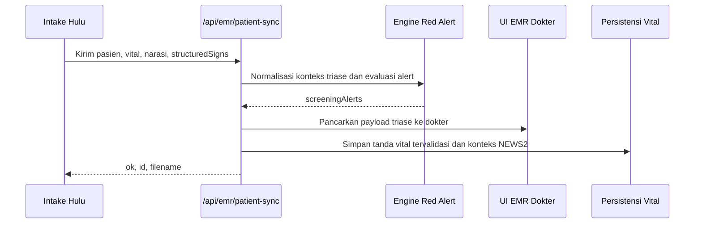

# Referensi API

AADI (Augmented Artificial Intelligence Diagnosis Integrated) menyediakan endpoint REST API melalui rute API App Router Next.js.

## URL Dasar

```
https://puskesmasbalowerti.com/api
```

## Autentikasi

Semua endpoint API memerlukan **cookie sesi crew** yang valid. Autentikasi berbasis cookie (bukan berbasis token).

```bash
# Login
POST /api/auth/login
Content-Type: application/json

{
  "username": "dokter.example",
  "password": "****"
}
```

Beberapa rute estafet antar-mesin (*machine-to-machine*) adalah pengecualian. `POST /api/emr/patient-sync` dan `GET /api/emr/patient-sync` menggunakan header `X-Crew-Access-Token` agar klien pengambilan data hulu yang terpercaya dapat mengirimkan data triase tanpa memerlukan sesi browser interaktif.

## Modul API

<CardGroup cols={2}>
  <Card title="CDSS" icon="brain" href="/api-reference/cdss">
    Endpoint dukungan keputusan klinis
  </Card>
  <Card title="EMR" icon="file-medical" href="/api-reference/emr">
    Pengisian otomatis rekam medis elektronik
  </Card>
  <Card title="Telemedicine" icon="video" href="/api-reference/telemedicine">
    Manajemen konsultasi video
  </Card>
  <Card title="Suara" icon="microphone" href="/api-reference/voice">
    Endpoint Artificial Intelligence suara Audrey
  </Card>
  <Card title="Admin" icon="shield" href="/api-reference/admin">
    Administrasi pengguna dan sistem
  </Card>
  <Card title="Auth" icon="lock" href="/api-reference/authentication">
    Manajemen autentikasi dan sesi
  </Card>
</CardGroup>

## Format Respons

Semua respons API mengikuti struktur JSON yang konsisten:

```json
{
  "success": true,
  "data": { ... },
  "error": null
}
```

## Sinyal Triase Terstruktur

Estafet triase EMR menerima objek `structuredSigns` opsional pada `POST /api/emr/patient-sync`. Payload ini memungkinkan sistem hulu untuk mengirimkan observasi samping tempat tidur sebagai kolom terstruktur yang eksplisit, alih-alih hanya mengandalkan inferensi teks.

```json
{
  "structuredSigns": {
    "respiratoryDistress": {
      "accessoryMuscleUse": true,
      "retractions": true,
      "unableToSpeakFullSentences": true,
      "cyanosis": false,
      "distressObserved": true
    },
    "hmod": {
      "chest_pain": false,
      "pulmonary_edema": false,
      "neurological_deficit": false,
      "vision_changes": false,
      "severe_headache": false,
      "oliguria": true,
      "altered_mental_status": true
    },
    "dkaHhs": {
      "kussmaul_breathing": true,
      "acetone_breath": false,
      "nausea_vomiting": true,
      "abdominal_pain": false,
      "altered_mental_status": true,
      "severe_dehydration": true,
      "extreme_hyperglycemia": true,
      "seizures": false
    },
    "perfusionShock": {
      "dizziness": true,
      "presyncope": true,
      "syncope": false,
      "weakness": true,
      "clammySkin": true,
      "coldExtremities": true,
      "oliguria": true,
      "capillaryRefillSec": 4
    }
  }
}
```

Kolom-kolom ini diperlakukan sebagai input kelas utama oleh engine *red alert*. Data ini digunakan untuk memperkuat deteksi distres pernapasan, gawat darurat hipertensi dengan HMOD, DKA/HHS, dan syok perfusi sebelum dokter memulai tinjauan teks bebas.

### Urutan Estafet


