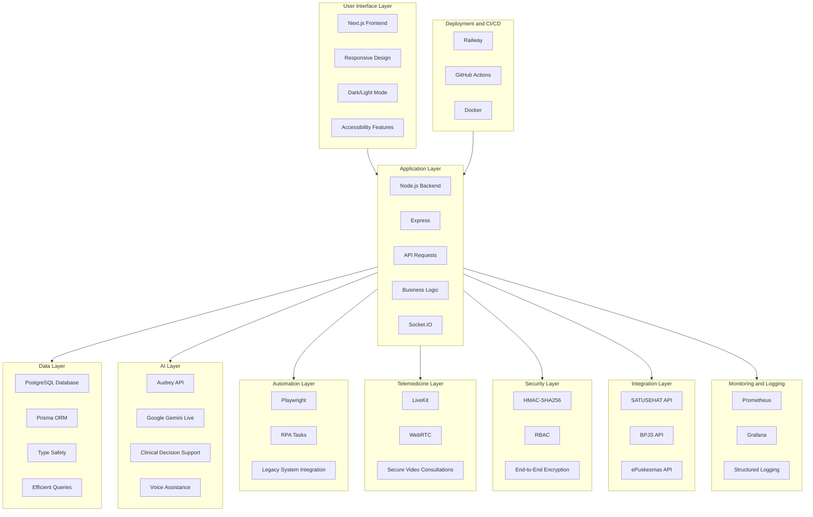

# Architecture

AADI uses a **custom server architecture** combining Next.js App Router with Socket.IO for real-time features.

## Arsitektur Sistem: Inovasi Teknologi Tinggi

### Arsitektur Monolitik Terkontainerisasi

Platform ini menggunakan pendekatan **single-container, single-tenant** untuk menjamin kesederhanaan deployment, pemeliharaan, dan isolasi data yang kuat. Integrasi erat antara frontend (Next.js) dan backend (Node.js) melalui Prisma ORM memastikan performa yang optimal.



### Justifikasi Pemilihan Teknologi

| Komponen | Teknologi | Alasan Pemilihan | Manfaat Utama |
| :--- | :--- | :--- | :--- |
| **Frontend** | Next.js 14 | SSR, TypeScript, dan optimasi performa | Pengalaman pengguna yang sangat cepat |
| **Backend** | Node.js + Express | Kontrol penuh atas Socket.IO dan RPA | Integrasi yang mulus dan performa tinggi |
| **Database** | PostgreSQL + Prisma | Typing kuat dan migrasi otomatis | Keamanan data dan kemudahan pemeliharaan |
| **RPA Engine** | Playwright 1.58.2 | Integrasi dengan UI legacy tanpa API publik | Otomatisasi proses administratif manual |
| **AI Layer** | Google Gemini Live | NLP dan asisten suara real-time | Dukungan diagnostik akurasi tinggi |
| **Telemedicine** | WebRTC + LiveKit | Kualitas HD dan latensi rendah | Konsultasi jarak jauh yang aman |
| **Autentikasi** | HMAC-SHA256 | Autentikasi stateless yang ringan | Keamanan tinggi tanpa kompleksitas sesi |
| **Deployment** | Railway | Infrastruktur cloud otomatis (Nixpacks) | Kemudahan deployment dan skalabilitas |
| **Monitoring** | Prometheus + Grafana | Pemantauan sistem real-time | Deteksi dini masalah operasional |

---

## Struktur Proyek (Project Structure)

```
primary-healthcare/
├── server.ts                          # Custom HTTP + Socket.IO + Gemini Live
├── src/
│   ├── app/                           # Next.js App Router pages
│   │   ├── api/                       # API route handlers
│   │   ├── dashboard/intelligence/    # Intelligence Dashboard UI
│   │   ├── emr/                       # EMR transfer UI
│   │   ├── telemedicine/              # Video consultation UI
│   │   └── voice/                     # Audrey voice UI
│   ├── lib/
│   │   ├── cdss/                      # Core Clinical Engine (AADI)
│   │   ├── clinical/                  # Clinical utilities
│   │   ├── emr/                       # EMR Playwright engine
│   │   └── audrey-persona.ts          # Voice AI persona
│   ├── components/                    # UI components
│   └── hooks/                         # Custom React hooks
├── prisma/                            # Schema + seed
└── scripts/                           # Test scripts
```

---

<sub>Dikembangkan oleh Sentra Healthcare Artificial Intelligence.</sub>
