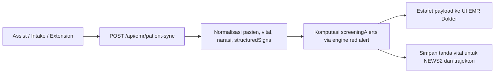

# Transparansi Standar Medis

AADI dirancang untuk lingkungan klinis di mana transparansi bukan sekadar fitur, melainkan persyaratan. Dokumen ini menguraikan bagaimana API kami menangani data klinis dan memastikan bahwa setiap keputusan berbantuan Artificial Intelligence dapat ditelusuri dan diaudit.

## Alur Penalaran Klinis (CDSS)

Saat Anda memanggil endpoint `/cdss/diagnose`, sistem tidak hanya memberikan diagnosis. Sistem melakukan proses penalaran multi-tahap:

1.  **Analisis Subjektif**: Membedah keluhan pasien dan riwayat untuk kata kunci klinis.
2.  **Korelasi Objektif**: Mengaitkan keluhan dengan tanda-tanda vital (misalnya: Takikardia dengan Nyeri Dada).
3.  **Logika Diferensial**: Menghasilkan beberapa kemungkinan diagnosis berdasarkan pola ICD-10.
4.  **Deteksi Red Flag**: Penandaan segera untuk kondisi yang mengancam nyawa (misalnya: Sindrom Koroner Akut).

### Penelusuran (Traceability)
Setiap respons dari engine CDSS menyertakan kolom `analysis`. Kolom ini berisi "Alur Penalaran" (Chain of Thought) yang digunakan oleh Artificial Intelligence untuk sampai pada saran tersebut, memungkinkan dokter yang berkugas untuk memverifikasi logika tersebut.

## Input Red Flag Terstruktur

Dashboard ini juga menerima *red flag* hasil observasi perawat sebagai payload terstruktur selama estafet triase EMR. Pada `POST /emr/patient-sync`, klien *intake* hulu dapat mengirimkan objek `structuredSigns` bersama dengan tanda vital dan teks naratif.

Kontrak ini dikelompokkan ke dalam empat bundel observasi samping tempat tidur:

- `respiratoryDistress`: penggunaan otot bantu napas, retraksi, ketidakmampuan berbicara kalimat utuh, sianosis, dan distres napas yang terlihat.
- `hmod`: petunjuk gawat darurat hipertensi risiko tinggi seperti nyeri dada, edema paru, defisit neurologis, perubahan penglihatan, sakit kepala hebat, oliguria, dan penurunan kesadaran.
- `dkaHhs`: pernapasan Kussmaul, aroma aseton, mual atau muntah, nyeri perut, dehidrasi berat, hiperglikemia ekstrem, penurunan kesadaran, dan kejang.
- `perfusionShock`: pusing, presinkop, sinkop, lemas, kulit lembap/dingin, ekstremitas dingin, oliguria, dan keterlambatan pengisian kapiler (capillary refill delay).

Sinyal-sinyal ini diproses sebagai observasi klinis utama. Engine alert menggunakan data ini sebelum beralih ke inferensi teks, yang meningkatkan transparansi karena bukti pemicunya bersifat eksplisit dan dapat diaudit.

### Alur Estafet Triase

## Integritas Data EMR

Endpoint `/emr/transfer/run` adalah jembatan antara antarmuka kami dan EMR nasional (ePuskesmas).

### Pemeriksaan Keamanan
- **Validasi**: Data divalidasi terhadap skema klinis sebelum dikirim ke jembatan (bridge).
- **Log Audit**: Setiap transfer dicatat dengan `transferId`, stempel waktu, dan `pelayananId` untuk memastikan catatan permanen tentang apa yang dikirim ke sistem pemerintah.
- **Fail-Safe**: Jika jembatan gagal, sistem mengembalikan kode kesalahan mendetail daripada gagal secara diam-diam, memungkinkan intervensi manual.

## Privasi & Keamanan Data

- **Penguatan Sesi**: Semua panggilan API memerlukan sesi `cookieAuth` yang aman.
- **Pembatasan Laju (Rate Limiting)**: Endpoint kritis seperti `/auth/login` dilindungi dari serangan brute-force.
- **Jejak Audit**: Semua interaksi klinis dicatat dalam log audit internal untuk tinjauan kepatuhan (compliance).

---

> [!IMPORTANT]
> AADI (Augmented Artificial Intelligence Diagnosis Integrated) adalah **alat bantu**. Semua keputusan klinis harus ditinjau dan dikonfirmasi oleh tenaga medis profesional yang berwenang.
