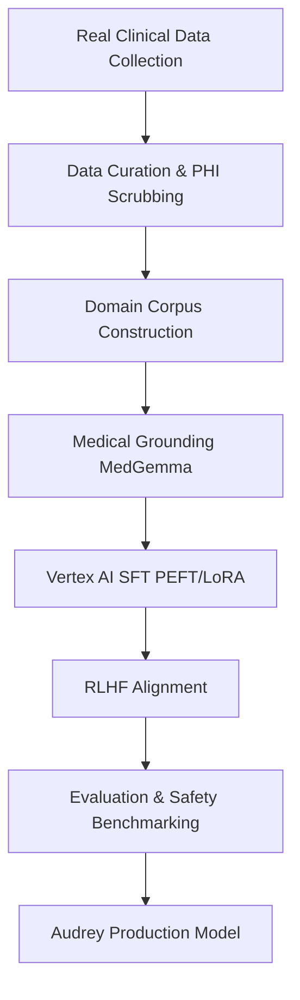

# Audrey Production Model

Audrey bukan sekadar model bahasa umum; ia adalah asisten klinis yang disempurnakan melalui pipeline **fine-tuning** yang ketat dan etis untuk memastikan keamanan pasien dan akurasi diagnostik.

## Alur Pembangunan Model

Kami menggunakan data klinis riil dari berbagai fasilitas kesehatan (RS, Puskesmas, IGD) yang telah melalui proses kurasi ketat.

## Tahapan Teknis

1. **Real Clinical Data Collection**: Pengumpulan data dari skenario klinis nyata di Puskesmas dan Rumah Sakit.
2. **Data Curation & PHI Scrubbing**: Review oleh tenaga medis profesional dan penghapusan data identitas pasien (PHI) untuk privasi maksimal.
3. **Domain Corpus Construction**: Penyusunan korpus medis lokal yang mencakup SOAP notes, ICD-10, dan SNOMED.
4. **Medical Grounding (MedGemma)**: Penyelarasan konsep medis menggunakan MedGemma dari Google DeepMind untuk logika klinis yang andal.
5. **Vertex AI SFT (PEFT/LoRA)**: Proses fine-tuning efisien menggunakan teknik Parameter-Efficient Fine-Tuning (PEFT) pada infrastruktur Vertex AI.
6. **RLHF Alignment**: Penguatan model melalui umpan balik manusia (Reinforcement Learning from Human Feedback) oleh panel dokter ahli.
7. **Evaluation & Safety**: Pengujian benchmark akurasi klinis dan deteksi kebocoran data (PHI leak).

## Hasil Evaluasi Model

| Metrik Evaluasi | Hasil |
| :--- | :--- |
| **Akurasi Klinis** | 92% |
| **Hallucination Rate** | \<2% |
| **Deteksi PHI Leak** | 100% |

---

Model Audrey dioptimalkan untuk kedaulatan data dan standar medis Indonesia.
