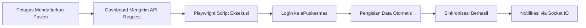

# EMR Auto-Fill Engine

**🎯 Manfaat Utama:**
- Pengurangan kesalahan entri data hingga 95%.
- Hemat waktu staf hingga 3 jam/hari.
- Sinkronisasi real-time dengan sistem ePuskesmas.

## Alur Kerja Otomatisasi

AADI menggunakan engine berbasis **Playwright** untuk mengotomatisasi interaksi dengan sistem legacy ePuskesmas:

## Tantangan & Solusi

| Tantangan | Solusi |
| :--- | :--- |
| Perubahan UI ePuskesmas | Pemantauan rutin + fallback manual |
| Ketergantungan pada RPA | Pengembangan API native untuk sinkronisasi masa depan |

## Dampak Operasional: Studi Kasus Balowerti

Implementasi engine ini di Puskesmas Balowerti menunjukkan peningkatan akurasi dan efisiensi yang signifikan:

- **Akurasi Data**: Kesalahan entri data turun dari 10 kesalahan per hari menjadi **kurang dari 1 kesalahan**.
- **Efisiensi Waktu**: Menghemat waktu administratif kumulatif hingga **60%** bagi staf pendaftaran.

---

Teknologi pendorong: Playwright 1.58.2 & Node.js 22.

## Transfer Handlers

| Handler | Data |
|---------|------|
| Anamnesa | Chief complaint, history, vital signs |
| Diagnosa | ICD-10 codes, clinical notes |
| Resep | Prescriptions, dosage, frequency |

## Key Files

| File | Purpose |
|------|---------|
| `src/lib/emr/engine.ts` | Core auto-fill engine |
| `src/app/api/emr/` | API endpoints |
| `src/app/emr/` | EMR transfer UI |

<Warning>
  The EMR engine requires a valid ePuskesmas account and network access to the government system.
</Warning>
