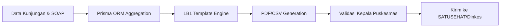

# Pelaporan Otomatis (LB1)

Beban administratif terbesar di Puskesmas seringkali berasal dari kewajiban pelaporan manual yang memakan waktu berjam-jam. AADI mengotomatisasi seluruh proses ini dengan **Akurasi 100%**.

## Manfaat Operasional

- **Penghematan Waktu**: Waktu penyusunan laporan berkurang dari rata-rata 4 jam menjadi hanya **5 menit**.
- **Kepatuhan Standar**: Penjaminan 100% format laporan sesuai standar nasional (LB1).
- **Validasi Data**: Sistem melakukan validasi otomatis sebelum laporan dikirim untuk menghindari kesalahan manusia.

## Alur Kerja Pelaporan

## Integrasi SATUSEHAT

AADI dirancang untuk sinkronisasi mulus dengan platform **SATUSEHAT** Kementerian Kesehatan:
- **Mapping Kode**: Konversi otomatis diagnosis lokal ke format ICD-10 yang diakui secara nasional.
- **API Sinkronisasi**: Mengirimkan data kunjungan secara berkala melalui endpoint terenkripsi.

### Hasil Implementasi (Studi Kasus)
- **Waktu Pelaporan**: Turun drastis dari 2 hari kerja/bulan menjadi hanya **1 jam** per bulan secara kumulatif.
- **Tingkat Kesalahan**: Menurun dari 20% (manual) menjadi **0%** melalui validasi otomatis.

---

Teknologi pendorong: Prisma ORM, PDF-Lib, & Node.js Backend.
