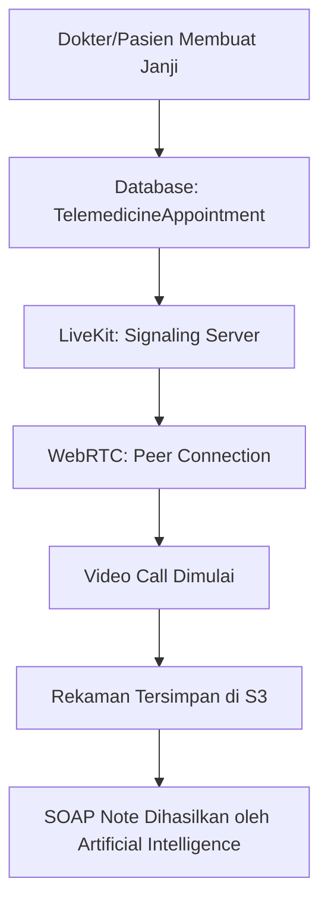

# Modul Telemedicine

AADI menyediakan fasilitas konsultasi jarak jauh berkualitas tinggi yang terintegrasi langsung dengan rekam medis (EMR), memungkinkan akses kesehatan bagi pasien di daerah terpencil.

## Arsitektur Telemedicine

Sistem menggunakan kombinasi **WebRTC** dan **LiveKit** untuk menjamin latensi rendah dan keamanan end-to-end:

## Optimasi Kinerja

Untuk melayani infrastruktur di berbagai wilayah Indonesia, AADI menerapkan:
- **Adaptive Bitrate**: Otomatis menyesuaikan kualitas video pada koneksi bandwidth rendah.
- **TURN Server**: Menjamin konektivitas stabil bahkan di belakang jaringan firewall terbatas.
- **Kualitas HD**: Optimasi kompresi untuk visualisasi klinis yang tajam bahkan di jaringan 3G.

## Dampak Implementasi
- **Aksesibilitas**: Konsultasi telemedicine meningkat dari 10% menjadi **60%** dari total kunjungan di wilayah uji coba.
- **Kepuasan Pasien**: Tingkat kepuasan mencapai **85%** karena kemudahan akses tanpa harus melakukan perjalanan fisik.

---

Teknologi pendorong: WebRTC, LiveKit, & Next.js.
