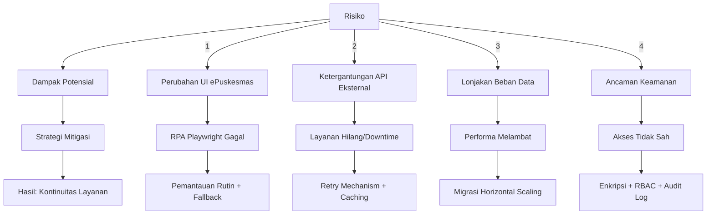

# Risiko & Mitigasi

Implementasi sistem kesehatan digital di lingkungan Puskesmas menghadapi berbagai tantangan unik. AADI menerapkan strategi mitigasi proaktif untuk menjamin kontinuitas layanan.

## Matriks Risiko & Mitigasi

| Risiko | Dampak Potensial | Strategi Mitigasi | Contoh Aplikasi |
| :--- | :--- | :--- | :--- |
| **Perubahan UI Legacy** | RPA Playwright gagal | Pemantauan rutin + Fallback manual | Dashboard tetap operasional saat ePuskesmas update |
| **Ketergantungan API** | Downtime layanan sekunder | Retry mechanism + Caching cerdas | Audrey tetap berfungsi dengan model lokal |
| **Skalabilitas** | Penurunan kinerja sistem | Rencana migrasi ke Microservices | Arsitektur monolitik yang terkontainerisasi |
| **Keamanan Data** | Kebocoran data (PHI) | Enkripsi end-to-end + Audit Log | HMAC-SHA256 untuk setiap akses kru |

## Visualisasi Alur Mitigasi

## Keamanan Data (PHI)

AADI memperlakukan data kesehatan pasien (Protected Health Information) sebagai aset paling sensitif:
- **Deteksi PHI Leak**: Model AI kami dilatih untuk mendeteksi dan mencegah pengiriman data identitas pasien ke API eksternal yang tidak aman.
- **Audit Logs**: Setiap akses data pasien dicatat secara permanen dengan stempel waktu dan identitas kru yang melakukan akses.

---

Strategi mitigasi ini dikembangkan untuk menjamin ketersediaan layanan kesehatan primer 24/7 di Indonesia.
